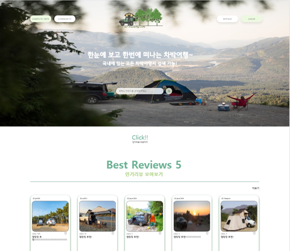
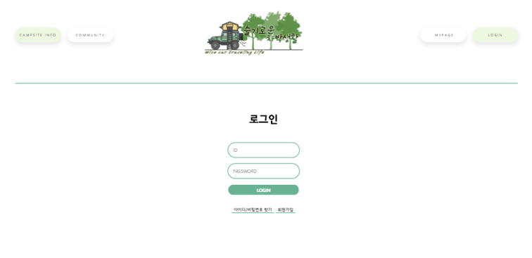
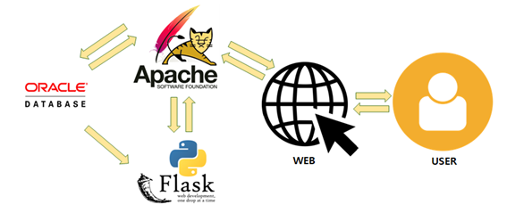

# 프로젝트 주제 : 슬기로운 차박생활
#### 팀원 고민준, 김종훈, 이주은, 유형근

‘슬기로운 차박생활’은 코로나 시대에 사회적 거리두기를 염두에 두면서도 여행을 떠나고 싶은 이들을 대상으로, 차를 타고 멀리 떠나 아늑한 공간에서 휴식을 즐길 수 있는 ‘차박’ 야영장에 대한 정보 검색 사이트이다. 
주요 기능으로는 야영지 검색, 사용자 리뷰 추천, 커뮤니티 기능 등이 있다.
야영지 검색은 공공데이터에서 가져온 야영지 정보, 다른 사용자가 작성한 커뮤니티 리뷰 글, 블로그에서 검색한 내용 등을 한 눈에 볼 수 있도록 하며 사용자 리뷰 추천은 회원 한정으로 머신러닝을 활용하여 사용자 취향의 리뷰를 추천한다. 또한 회원이라면 누구나 자유롭게 자신의 경험을 리뷰로 작성해 다른 사용자들에게 정보를 공유할 수 있으며, 각 리뷰에는 댓글/대댓글을 작성, ’좋아요’ 누르기 등의 기능을 사용할 수 있다. 그 외에 사용자 간의 팔로우/팔로워 기능, 메시지 전송 기능 등의 커뮤니티 기능을 제공한다.

## 구성도

## 사용 기술
- 개발 환경 : Window 10
- 개발 도구 : Oracle 11g, IntelliJ, Pycharm, Spring Framework, Flask
- 사용 DB : OracleDB
- 개발 라이브러리 : Scikit-leam, Maven, JQuery, SmartEdition2
- 사용 언어 : HTML5/CSS3, Javascript, Jquery, JAVA, Python, JSP
- 사용 기술 : Ajax, Jquery, Mybatis, Oracle SQL
- PORT : jdk 14 이상 localhost:8030

## 설계의 주안점
- 사용자가 원하는 정보를 보다 정확히 얻을 수 있도록 함
- 편안하고 한눈에 들어오는UI와 편안한 마음을 가지게 하는 색상 처리
- 사용자끼리 상호작용할 수 있는 커뮤니케이션 기능

## 주요역할 및 담당
- 슬기로운 차박생활 로고 디자인
- 메인, 야영장 검색, 야영장 상세, 관리자 페이지 디자인 및 퍼블리싱
- 관리자 페이지 : 회원관리(회원 조회 및 부적절한 아이디 및 비매너 회원 삭제가능) 구현
                  커뮤니티 리뷰 사이트 게시글 삭제 권한 구현
                  리뷰 댓글 및 대댓글 삭제 권한 구현
- 야영장 페이지 : 카카오 맵 API를 이용하여 지도 구현
                  검색 및 조회 내용을 통하여 야영장 정보 상세 페이지 구현
                  커뮤니티 리뷰 조회수 순으로 조회 및 페이징 구현
- 야영장 상세 페이지 : 카카오 맵 데이터와 공공데이터를 활용하여 야영장 상세 정보 조회 구현
                       조회에 따른 리뷰 정보 조회 및 페이징 구현
                       네이버 블로그 API를 이용하여 조회에 따른 블로그 조회 및 페이징 구현

				   
## 미리보기
<iframe width="640" height="360" src="https://www.youtube.com/watch?v=FErD_9fM9ZM" frameborder="0" gesture="media" allowfullscreen=""></iframe>
 					  