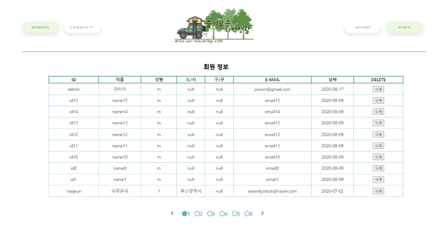

# 프로젝트 주제 : 슬기로운 차박생활
{: width="30%" height="7%"}
{: width="30%" height="7%"}
{: width="30%" height="7%"}
‘슬기로운 차박생활’은 코로나 시대에 사회적 거리두기를 염두에 두면서도 여행을 떠나고 싶은 이들을 대상으로, 차를 타고 멀리 떠나 아늑한 공간에서 휴식을 즐길 수 있는 ‘차박’ 야영장에 대한 정보 검색 사이트이다. 
주요 기능으로는 야영지 검색, 사용자 리뷰 추천, 커뮤니티 기능 등이 있다.
야영지 검색은 공공데이터에서 가져온 야영지 정보, 다른 사용자가 작성한 커뮤니티 리뷰 글, 블로그에서 검색한 내용 등을 한 눈에 볼 수 있도록 하며 사용자 리뷰 추천은 회원 한정으로 머신러닝을 활용하여 사용자 취향의 리뷰를 추천한다. 또한 회원이라면 누구나 자유롭게 자신의 경험을 리뷰로 작성해 다른 사용자들에게 정보를 공유할 수 있으며, 각 리뷰에는 댓글/대댓글을 작성, ’좋아요’ 누르기 등의 기능을 사용할 수 있다. 그 외에 사용자 간의 팔로우/팔로워 기능, 메시지 전송 기능 등의 커뮤니티 기능을 제공한다.

## 사용 기술
- 개발 환경 : Window 10
- 개발 도구 : Oracle 11g, IntelliJ, Pycharm, Spring Framework, Flask
- 사용 DB : OracleDB
- 사용 언어 : HTML5/CSS3, Javascript, Jquery, JAVA, Python
- 사용 기술 : Ajax, Jquery, Mybatis, Oracle SQL
- PORT : localhost:8030